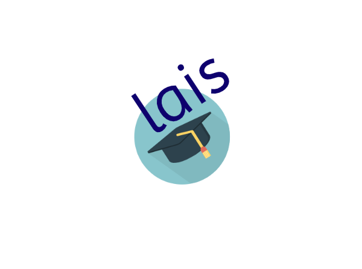
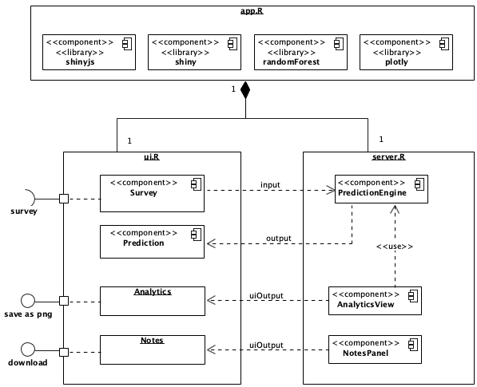
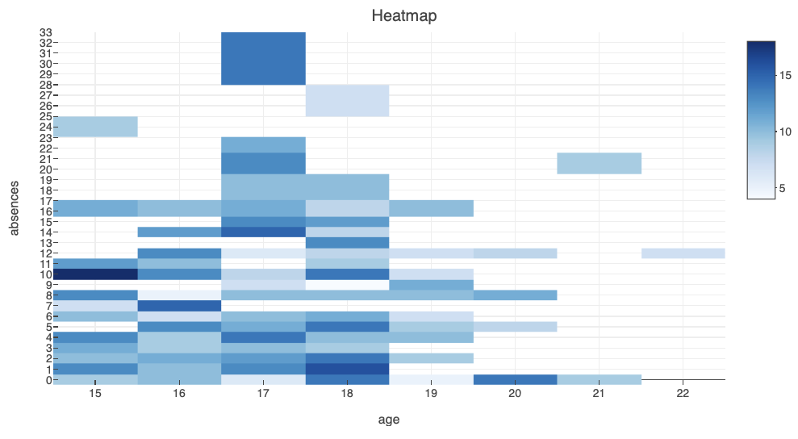
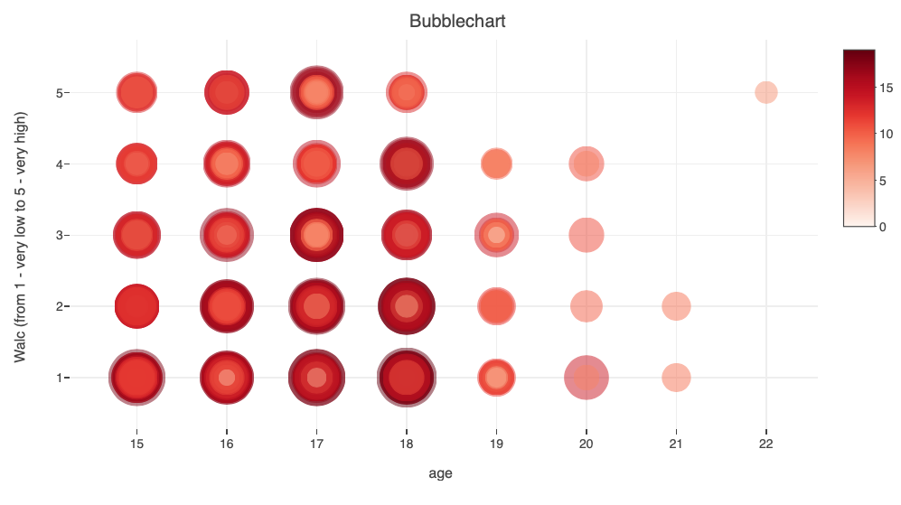

# Learning Analytics Insights 

  

# lais-learning-analytics-1819
Learning Analytics Insights is a Project developed as a part of Learning Analytics lecture(WS 18/19), taught by Prof. Dr. Mohamed Chatti and Dr. Arham Muslim at the University of Duisburg Essen. The R based application can be used for predicting student grades (based on inputs taken from a Survey and an open source data set) and for visualizing the results.

  

# Dataset
https://archive.ics.uci.edu/ml/datasets/student+performance

# Description of used libraries(R-packages)/algorithms
shiny: Web Application Framework for R.
shinyjs: To Easily Improve the User Experience of Your Shiny Apps in Seconds
plotly: To Create Interactive Web Graphics via 'plotly.js'
caret: The caret package (short for _C_lassification _A_nd _RE_gression _T_raining) is a set of functions that attempt to streamline the process for creating predictive models. Used for: 
                                                                data splitting
                                                                pre-processing
                                                                feature selection
                                                                model tuning using resampling
                                                                variable importance estimation
 
randomForest: Breiman and Cutler's Random Forests for Classification of grades into three classes 
Random forests or random decision forests are an ensemble learning method for classification, regression and other tasks that operates by constructing a multitude of decision trees at training time and outputting the class that is the mode of the classes (classification) or mean prediction (regression) of the individual trees.[1][2] Random decision forests correct for decision trees' habit of overfitting to their training set.

# Example visualizations

  

  

 
# How to run the project

1. Create a folder where your project code should be saved, say 'lais-app'.

2. git clone
3. Install R in your system: 
https://cran.r-project.org/mirrors.html

Also recommended: R Studio (if in case you want to play around with the code)
https://www.rstudio.com/products/rstudio/download/

4. Install the above mentioned packages using install(packagename) 

5. Use runApp("lais-app") in R command line to launch your application.

# Link to Project Video
https://www.youtube.com/watch?v=YfhbxSe0qtM&feature=youtu.be

# Group Members
Volkan Yücepur  
Ankita Mandal  
Florian Richtscheid  
Hadis Fouladikia  
Negin Ahmadian  
Moloud Kordestani  

